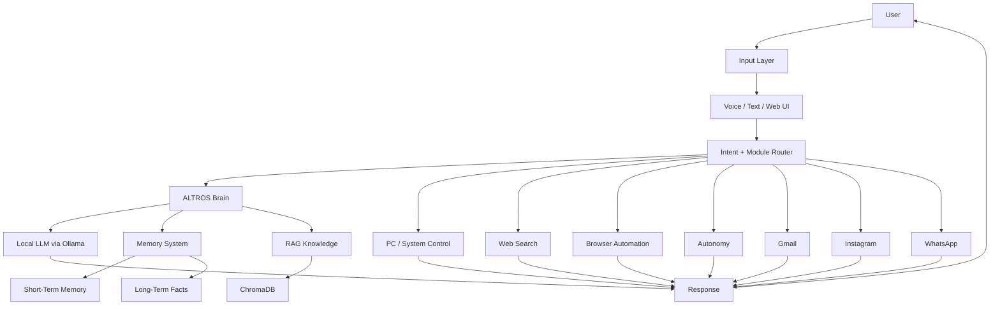

<div align="center">

# <span style="color:#7C3AED;">ALTROS</span>

### <span style="color:#2563EB;">Autonomous Learning & Tactical Reasoning Operating System</span>

**A modular personal AI operating system designed to act as a digital brain — not just a chatbot.**

<p>
  
  
  
  
  
</p>

<p><b>Built by Manish Kuntal · B.Tech CSE · India</b></p>

</div>

---

## 🧠 What is ALTROS?

> **ALTROS is a local-first personal AI system that connects an LLM with memory, knowledge retrieval, voice, web search, automation and computer control.**

ALTROS is designed around one idea:

**AI should be able to understand → remember → reason → retrieve knowledge → take actions → report the result.**

Instead of using a separate tool for every small task, ALTROS provides a modular control layer around a local AI brain.

The system combines:

- 🧠 **Local AI Brain** — Ollama-powered LLM
- 🗃️ **Persistent Memory** — short-term + long-term + semantic knowledge
- 📚 **RAG Knowledge Base** — teach ALTROS from PDFs/books
- 🌐 **Real-Time Web Search** — current information retrieval
- 🎙️ **Voice I/O** — speech-to-text + text-to-speech
- 🔊 **Wake-Word Activation** — hands-free activation
- 🖥️ **PC Control** — applications, files and system actions
- 🌍 **Browser Automation** — browser-based workflows
- 📱 **Phone Web UI** — Jarvis-style browser interface
- 📧 **Gmail Integration** — email workflows
- 📸 **Instagram Integration** — supported social workflows
- 💬 **WhatsApp Bridge** — Node.js based integration
- ⏰ **Autonomy** — tasks, reminders and scheduled actions
- 🚀 **FastAPI Server** — local API + streaming interface
- 🧩 **Modular Architecture** — features can be enabled/disabled independently

The original build guide describes ALTROS as a fully local personal assistant with local AI, memory, RAG, voice, internet search, PC control, phone access and third-party integrations. fileciteturn18file0L20-L39

---

## 🌎 Real-World Impact

ALTROS is intended to reduce the gap between **asking an AI something** and **having an AI system actually perform a workflow**.

### 🎓 Student / Learning

ALTROS can become a personal study assistant that:

- learns from textbooks and PDFs
- retrieves relevant passages from a personal knowledge base
- answers questions using stored context
- remembers goals, preferences and recurring tasks
- provides reminders and daily briefings

The build guide documents PDF ingestion through RAG, chunking text, creating embeddings, storing them in ChromaDB and retrieving relevant chunks for the LLM. fileciteturn18file0L354-L377

### 💻 Developer Workflow

ALTROS can act as a local development companion:

```text
User
  ↓
ALTROS
  ↓
Understand intent
  ↓
Select module
  ↓
Execute / retrieve / search
  ↓
Return result
```

Examples include opening applications, creating folders, taking screenshots, controlling system settings and executing supported workflows.

### 📚 Personal Knowledge

Instead of repeatedly uploading the same documents, users can build a persistent knowledge layer.

```text
PDF / Book
    ↓
Text Extraction
    ↓
Chunking
    ↓
Embeddings
    ↓
ChromaDB
    ↓
Semantic Retrieval
    ↓
LLM Context
    ↓
Answer
```

### 🏠 Personal Automation

ALTROS can be used as a central automation layer for:

- reminders
- recurring tasks
- daily briefings
- desktop actions
- browser workflows
- communication workflows
- information retrieval

### 🔐 Privacy / Local AI

The core AI architecture is designed around local execution through Ollama rather than requiring a paid cloud LLM subscription. The build guide describes the project as local-first and privacy-oriented. fileciteturn18file0L20-L26

> **Important:** “Local AI” does not automatically mean every feature is local. Internet search, ngrok, Gmail, Instagram and WhatsApp integrations can communicate with external services when those features are used.

---

# 🏗️ Architecture



### Core flow

**Input → Intent → Routing → Memory/Knowledge/Tools → Action → Response**

The build guide describes the brain, memory, router, thinking engine, internet search, PC control, voice, server and autonomy modules as separate responsibilities. fileciteturn18file0L288-L321

---

# 🧩 Core Modules

| Module | Responsibility |
|---|---|
| `core/brain.py` | LLM communication and response generation |
| `core/memory.py` | Persistent memory and semantic knowledge |
| `core/router.py` | Routes requests to the appropriate module |
| `core/thinking.py` | Intent detection, planning and self-checking |
| `modules/knowledge.py` | PDF/book RAG pipeline |
| `modules/internet.py` | Web search and result filtering |
| `modules/voice.py` | Speech recognition + text-to-speech |
| `modules/wake_word.py` | Wake-word detection |
| `modules/pc_control.py` | Application, file and system control |
| `modules/browser_control.py` | Browser automation |
| `modules/mouse_keyboard.py` | Mouse and keyboard automation |
| `modules/system_control.py` | Windows/system controls |
| `modules/terminal_control.py` | Terminal command execution |
| `modules/event_watcher.py` | Reactive file/process monitoring |
| `modules/autonomy.py` | Tasks, reminders and autonomous routines |
| `modules/server.py` | FastAPI + streaming web API |
| `modules/gmail.py` | Gmail workflows |
| `modules/instagram.py` | Instagram workflows |
| `modules/whatsapp.py` | WhatsApp bridge communication |
| `modules/window_control.py` | Window management |
| `modules/scheduler.py` | Scheduled actions |

---

# ✨ Feature Overview

## 🧠 Local AI Brain

ALTROS uses **Ollama** as the local model runtime.

Typical flow:

```text
ALTROS
  ↓
Brain
  ↓
Ollama API
  ↓
Local LLM
  ↓
Response
```

The build guide uses Llama 3 as the documented local model. fileciteturn18file0L423-L442

> Your installed model can be changed through the ALTROS configuration. Make sure the configured model exists in Ollama.

---

## 🗃️ Memory System

ALTROS uses multiple memory layers:

### 1. Short-Term Memory
Recent conversation context.

### 2. Long-Term Memory
Important facts, preferences, goals and persistent information.

### 3. Semantic Knowledge
Documents/books indexed for semantic retrieval.

The documented build uses JSON persistence for user/fact/task data and ChromaDB for semantic book knowledge. fileciteturn18file0L292-L294

---

## 📚 RAG / Book Learning

Teach ALTROS a PDF:

```powershell
py -3.12 main.py --add-book "C:\Path\To\Book.pdf"
```

Example:

```powershell
py -3.12 main.py --add-book "C:\Users\Manish\Downloads\Atomic Habits.pdf"
```

Pipeline:

```text
PDF
 ↓
Text Extraction
 ↓
Chunking
 ↓
Embedding
 ↓
ChromaDB
 ↓
Semantic Search
 ↓
Relevant Context
 ↓
Local LLM
```

The documented pipeline uses approximately 800-character chunks and semantic retrieval through ChromaDB. fileciteturn18file0L354-L370

---

## 🌐 Internet Search

ALTROS can use web search for information that should not be answered from stale model knowledge.

Example requests:

```text
latest technology news
current weather
latest product information
current market information
search the web for ...
```

The documented implementation uses DDGS/DuckDuckGo search with query optimization, filtering and duplicate removal. fileciteturn18file0L301-L303

---

## 🖥️ PC & System Control

Examples:

```text
open Chrome
open VS Code
take a screenshot
increase volume
mute the system
create a folder
open Calculator
open Task Manager
```

The PC control layer is designed to perform supported desktop/file/system actions while applying safety checks to dangerous operations. fileciteturn18file0L304-L306

---

## 🎙️ Voice Mode

ALTROS supports:

- microphone input
- speech-to-text
- AI response
- text-to-speech
- continuous conversation
- interruption/barge-in behavior
- wake-word activation

The documented voice stack uses Whisper for speech recognition and a local TTS engine. fileciteturn18file0L307-L310

---

## 📱 Phone Access

ALTROS exposes a web interface through its FastAPI server.

Local server:

```text
http://localhost:8000
```

For remote/phone access, the documented build uses ngrok:

```powershell
ngrok http 8000
```

The build guide describes the phone interface as a browser-based Jarvis-style UI. fileciteturn18file0L223-L227

### ⚠️ Security

Do **not** expose an unrestricted local-control server to the public internet.

If you use ngrok or another tunnel:

- protect sensitive endpoints
- do not publish secrets
- do not expose unrestricted terminal control
- review authentication before production use
- rotate leaked credentials immediately

---

# 🔌 Integrations

## Gmail

The documented integration uses the Gmail API with OAuth 2.0.

Possible workflows include:

```text
check inbox
show unread emails
search email
read latest email
send email
reply to email
```

Gmail requires Google Cloud configuration and OAuth credentials. fileciteturn18file0L323-L339

---

## Instagram

The documented integration uses `instagrapi`.

Supported workflows include:

```text
login
post
DM
search profiles
follow
unfollow
view inbox
```

Use social automation carefully and follow the platform's rules. The build guide specifically notes avoiding excessive actions. fileciteturn18file0L340-L345

---

## WhatsApp

ALTROS can communicate with a Node.js WhatsApp bridge.

Architecture:

```text
ALTROS Python
      ↓
WhatsApp Module
      ↓
Node.js Bridge
      ↓
WhatsApp Web
```

The documented setup uses `whatsapp-web.js` and `qrcode-terminal`. fileciteturn18file0L346-L352

---

# 💻 Requirements

## Recommended Hardware

The documented build was developed around:

| Component | Recommended |
|---|---|
| CPU | Intel i7 13th Gen / equivalent |
| GPU | NVIDIA RTX 4050 6GB / equivalent |
| RAM | 16GB |
| Storage | 512GB SSD or more |
| OS | Windows 11 |
| Internet | Broadband connection |

The build guide lists 16GB RAM and an NVIDIA RTX 4050 6GB in its reference build. fileciteturn18file0L41-L49

## Minimum

| Component | Minimum |
|---|---|
| CPU | Modern i5 / Ryzen 5 class CPU |
| RAM | 8GB |
| GPU | Optional |
| Free Storage | ~20GB+ |
| OS | Windows 10/11 |
| Microphone | Required for voice |
| Internet | Required for web/integration features |

The documented minimum hardware requirements are approximately 8GB RAM and 20GB free storage, with a GPU optional but useful for local AI workloads. fileciteturn18file0L50-L55

---

# 🧰 Software Requirements

Install:

1. **Python 3.12**
2. **Ollama**
3. **Node.js** — required for WhatsApp bridge
4. **Git**
5. **ngrok** — optional, for phone/public tunnel
6. **Microphone + speakers** — for voice mode

> The repository's `requirements.txt` should be treated as the source of truth for Python packages. The older build guide contains a package list, but package versions can change over time.

---

# 📦 Python Dependencies

The documented build uses packages including:

```text
requests
chromadb
pypdf
openai-whisper
sounddevice
numpy
pyttsx3
keyboard
fastapi
uvicorn
ddgs
pyautogui
pillow
google-auth-oauthlib
google-auth-httplib2
google-api-python-client
instagrapi
aiofiles
```

Install the repository dependencies with:

```powershell
py -3.12 -m pip install -r requirements.txt
```

If your current `requirements.txt` contains additional packages, install those as well.

---

# 🟢 Quick Start — Existing ALTROS Installation

If ALTROS is already installed and configured on your Windows machine:

```powershell
cd C:\Users\manis\ALTROS
py -3.12 main.py
```

Before starting, make sure Ollama is available.

```powershell
ollama serve
```

Then open another terminal:

```powershell
cd C:\Users\manis\ALTROS
py -3.12 main.py
```

The documented manual startup sequence uses Ollama first and then `main.py`. fileciteturn18file0L202-L213

---

# ⚡ One-Click Start

This build includes a Windows startup `.bat` workflow.

The provided startup script is designed to:

```text
1. Clean previous ALTROS-related processes
2. Start Ollama
3. Start ALTROS
4. Wait for the FastAPI server
5. Start ngrok
6. Detect the public ngrok URL
7. Open ALTROS automatically
```

### Direct launch

If the repository's startup script is configured for your installation path, double-click:

```text
start_altros_direct.bat
```

Or run it from CMD:

```cmd
start_altros_direct.bat
```

### Important

The current direct-start script is configured around:

```text
C:\Users\manis\ALTROS
```

and:

```text
py -3.12 main.py
```

Therefore, a different computer may need the path and Python command adjusted.

The script also expects `ollama`, `curl`, `powershell`, and `ngrok` to be available on the system PATH.

---

# 🆕 Fresh Installation

## 1. Clone

```powershell
git clone https://github.com/manish-kuntal/ALTROS.git
cd ALTROS
```

## 2. Verify Python

```powershell
py -3.12 --version
```

Expected:

```text
Python 3.12.x
```

## 3. Install Python dependencies

```powershell
py -3.12 -m pip install --upgrade pip
py -3.12 -m pip install -r requirements.txt
```

## 4. Install Ollama

Install Ollama, then download the model configured by your `config.py`.

For the documented Llama 3 setup:

```powershell
ollama pull llama3
```

Start the local Ollama service:

```powershell
ollama serve
```

The documented guide uses Ollama at:

```text
http://localhost:11434
```

and downloads the Llama 3 model before running ALTROS. fileciteturn18file0L70-L78

## 5. Optional: Node.js / WhatsApp

Verify:

```powershell
node --version
npm --version
```

Then:

```powershell
cd whatsapp
npm install
```

## 6. Optional: ngrok

Install ngrok and authenticate it:

```powershell
ngrok config add-authtoken YOUR_TOKEN
```

Then:

```powershell
ngrok http 8000
```

The build guide documents ngrok as the tunnel used for phone access. fileciteturn18file0L87-L93

---

# 🔐 Optional Integrations Setup

Some features require external accounts or credentials.

### Gmail

Requires:

```text
Google Cloud Project
        ↓
Gmail API enabled
        ↓
OAuth Client
        ↓
credentials.json
        ↓
First login
        ↓
OAuth token
```

Never commit:

```text
credentials.json
gmail_token.json
```

### Instagram

Requires an Instagram account/session.

Never commit:

```text
instagram_session.json
```

### WhatsApp

Requires linking a WhatsApp account through the bridge.

Never commit:

```text
wa_session/
```

### ngrok

Never commit:

```text
ngrok auth tokens
```

---

# 📁 Project Structure

```text
ALTROS/
│
├── main.py
├── config.py
├── requirements.txt
├── README.md
├── start_altros.bat
├── start_altros_direct.bat
│
├── core/
│   ├── brain.py
│   ├── memory.py
│   ├── router.py
│   ├── thinking.py
│   ├── action_logger.py
│   └── permissions.py
│
├── modules/
│   ├── base.py
│   ├── chat.py
│   ├── knowledge.py
│   ├── voice.py
│   ├── wake_word.py
│   ├── internet.py
│   ├── pc_control.py
│   ├── browser_control.py
│   ├── mouse_keyboard.py
│   ├── system_control.py
│   ├── terminal_control.py
│   ├── window_control.py
│   ├── event_watcher.py
│   ├── scheduler.py
│   ├── autonomy.py
│   ├── server.py
│   ├── gmail.py
│   ├── instagram.py
│   └── whatsapp.py
│
├── whatsapp/
│   ├── whatsapp_bridge.js
│   ├── package.json
│   └── package-lock.json
│
└── static/
    ├── index.html
    └── altros_url.html
```

---

# 🧪 Useful Commands

### Start ALTROS

```powershell
py -3.12 main.py
```

### Start Ollama

```powershell
ollama serve
```

### Check installed Ollama models

```powershell
ollama list
```

### Add a PDF

```powershell
py -3.12 main.py --add-book "C:\Path\Book.pdf"
```

### Start ngrok

```powershell
ngrok http 8000
```

### Start WhatsApp bridge

```powershell
cd whatsapp
node whatsapp_bridge.js
```

---

# 🗣️ Example Commands

### Conversation

```text
What is my current goal?
```

### Memory

```text
remember my goal is to become a software engineer
remember this project is ALTROS
remember my hobby is volleyball
```

### Knowledge

```text
What does Atomic Habits say about identity?
```

### PC

```text
open Chrome
open VS Code
take a screenshot
increase volume
create a project folder
```

### Internet

```text
search the web for the latest AI news
what is the current weather?
find the latest information about ...
```

### Tasks

```text
show my tasks
remind me tomorrow
give me my daily briefing
```

---

# 🌐 API

ALTROS includes a FastAPI server.

Default local address:

```text
http://localhost:8000
```

Documented endpoints include:

```text
/
 /chat
 /chat/stream
 /memory
 /remember
 /status
```

The server module is documented as FastAPI + Uvicorn with normal chat, streaming, memory and status endpoints. fileciteturn18file0L311-L314

> If you expose the server outside your machine, add proper authentication and access controls before doing so.

---

# 🛡️ Security

ALTROS can interact with your computer and personal accounts. Treat it like a privileged application.

### Never commit

```text
.env
credentials.json
gmail_token.json
instagram_session.json
wa_session/
browser_profile/
memory/
personal data
API keys
OAuth secrets
ngrok tokens
private documents
```

### Recommended

- keep credentials outside Git
- use `.env` for secrets where supported
- use `.gitignore`
- review permissions before enabling automation
- avoid exposing the FastAPI server publicly without authentication
- use confirmation gates for destructive actions
- rotate any credential that was accidentally exposed

---

# ⚠️ Current Limitations

ALTROS is an active engineering project.

Some capabilities depend on:

- installed models
- Python package versions
- Windows permissions
- microphone/audio drivers
- third-party service availability
- authentication configuration
- browser/session state
- network connectivity

Not every feature is available immediately after cloning.

**Core local chat requires Ollama + a configured local model.**

**Gmail, Instagram, WhatsApp and ngrok are optional integrations and require additional setup.**

---

# 🧭 Development Philosophy

ALTROS is built as a **modular AI operating layer**.

Instead of putting every capability into one giant file:

```text
User Request
     ↓
Thinking / Intent
     ↓
Router
     ↓
Specialized Module
     ↓
Tool / API / Local System
     ↓
Result
     ↓
Memory / Logging
     ↓
Response
```

This makes the system easier to extend.

Future modules can be added without rebuilding the complete architecture.

---

# 🚀 Roadmap

The original project roadmap includes ideas such as:

- 24/7 cloud deployment
- Google Calendar
- YouTube integration
- improved voice
- automatic learning from conversations
- multi-model support
- automated WhatsApp briefings
- news aggregation
- spending tracking
- native Android application
- multi-account Gmail
- business intelligence
- AI content creation
- voice cloning
- self-improving memory

These are development goals rather than guarantees of current functionality. fileciteturn18file0L402-L421

---

# 📊 Technology Stack

| Technology | Role |
|---|---|
| **Python** | Core application |
| **Ollama** | Local AI runtime |
| **Llama 3 / configured local model** | AI reasoning |
| **ChromaDB** | Semantic vector storage |
| **Whisper** | Speech recognition |
| **pyttsx3 / configured TTS** | Speech output |
| **FastAPI** | API server |
| **Uvicorn** | ASGI server |
| **DDGS** | Web search |
| **PyAutoGUI** | Desktop automation |
| **Node.js** | WhatsApp bridge |
| **whatsapp-web.js** | WhatsApp integration |
| **Google APIs** | Gmail integration |
| **instagrapi** | Instagram integration |
| **ngrok** | Optional remote tunnel |

The documented technology stack is based on free/open-source components, although some integrations require external accounts and services. fileciteturn18file0L423-L442

---

# 🏆 Why ALTROS?

ALTROS demonstrates a different approach to personal AI:

```text
Traditional Chatbot
      ↓
Question → Answer

ALTROS
      ↓
Question / Command
      ↓
Understand
      ↓
Remember
      ↓
Retrieve
      ↓
Reason
      ↓
Act
      ↓
Verify
      ↓
Respond
```

The goal is not simply to make an AI that **talks**.

The goal is to build an AI system that can **understand context, use tools, access personal knowledge and execute useful workflows while remaining local-first.**

---

# 👨‍💻 Author

**Manish Kuntal**

B.Tech Computer Science Engineering

India

### Project

**ALTROS — Autonomous Learning & Tactical Reasoning Operating System**

> Built as an independent engineering project exploring local AI, memory, RAG, automation, voice interfaces and computer control.

---

# 📜 License

MIT License.

See [`LICENSE`](LICENSE) for details.

---

<div align="center">

## <span style="color:#7C3AED;">ALTROS</span>

### <span style="color:#2563EB;">Your Personal AI Brain.</span>

**Local AI · Memory · Knowledge · Voice · Automation · Computer Control**

<br>

<sub>Built with Python, Ollama and open-source technologies.</sub>

</div>
